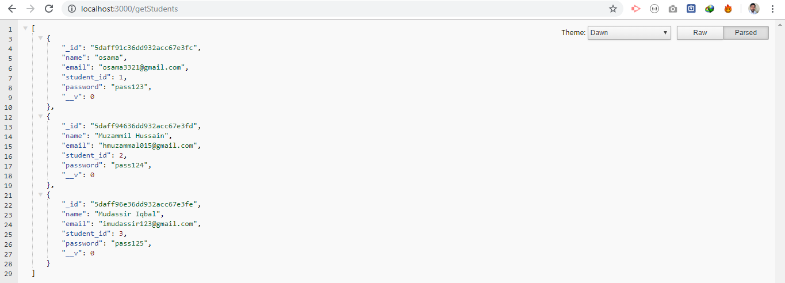
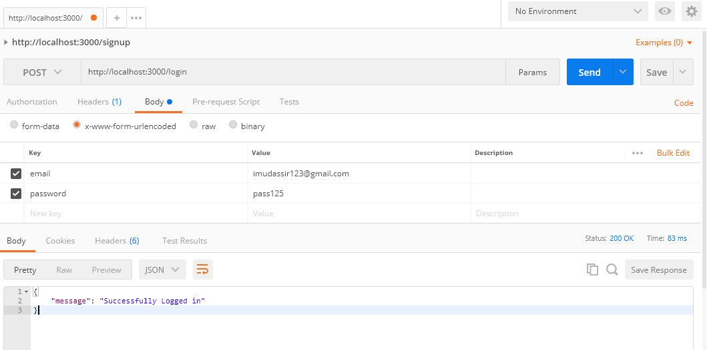
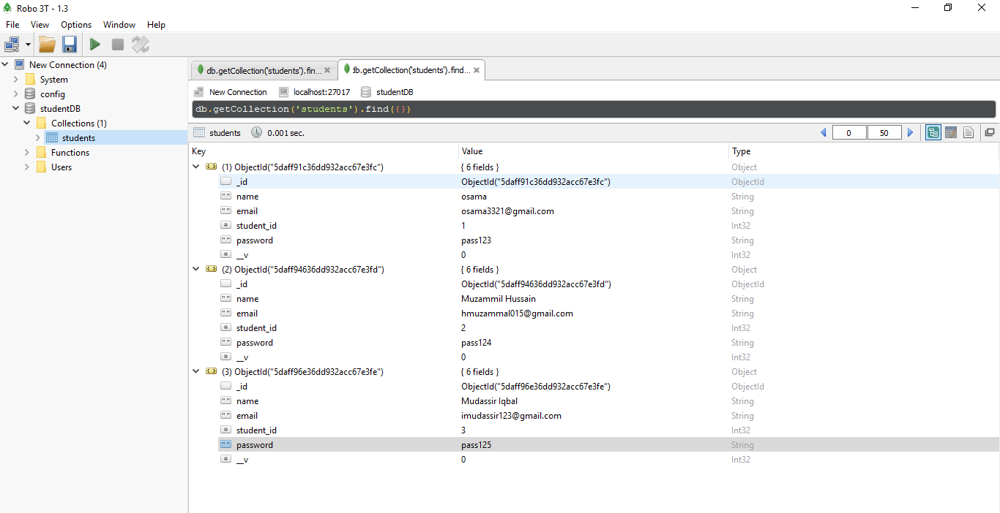

firstnodejsapp
Node REST API using mongoDB.
Get request from chrome with localhost:3000/getStudents endpoint.
 
 

Signup from postman REST API testing tool.
 
 

data collection in mongoDB client.
 
 

